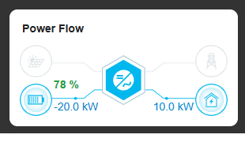

[](https://stand-with-ukraine.pp.ua)

#### Ukraine is still suffering from Russian aggression, [please consider supporting Red Cross Ukraine with a donation](https://redcross.org.ua/en/).

[](https://stand-with-ukraine.pp.ua)

---

# Livoltek system for Home Assistant

[](https://my.home-assistant.io/redirect/hacs_repository/?owner=uhodav&repository=ha_livoltek&category=integration)

[Українською нижче ⬇️]


Custom Home Assistant integration for Livoltek inverters and BESS via Livoltek cloud API.

## English

### Features
- UI setup via Config Flow (no YAML required)
- 5-step setup wizard:
  1. API credentials (`server`, `secuid`, `key`, `token`)
  2. Site selection
  3. Device selection + update interval
  4. Data group selection (choose endpoint groups to enable)
  5. Optional BESS control credentials (`account`, `password`)
- Selective data collection by endpoint groups (13 groups)
- **110 sensors** total (measurements + diagnostics)
- Human-readable enum values for statuses (PV, Grid, Load, Battery, Charging Pile, Running Status, Alarm Type, Battery Type)
- API rate limit enforcement (min 5 min interval, energy reports 1x/hour)
- BESS control entities:
  - 5 buttons (start/stop/restart/BMS restart/emergency charging)
  - 1 work mode select entity
- Service for setting work mode with optional schedule:
  - `ha_livoltek.set_work_mode_schedule`
- Multi-language UI (English/Ukrainian)

### Installation
#### Option 1: HACS
1. Open HACS
2. Add this repository as a custom integration (if needed)
3. Install **Livoltek system**
4. Restart Home Assistant

#### Option 2: Manual
1. Copy `custom_components/ha_livoltek` to your Home Assistant config directory:
   - `custom_components/ha_livoltek`
2. Restart Home Assistant

### Configuration values
#### Main setup (Config Flow)
- `server_type` — Livoltek server region (`international` / `european`)
- `secuid` — Security ID
- `key` — API key
- `token` — User token
- `account` (optional) — account for BESS control
- `password` (optional) — password for BESS control (stored as MD5)

#### Options (after setup) — 3-step wizard with pre-filled values
1. **API Credentials**: `server_type`, `secuid`, `key`, `token` — validates login on save
2. **Interval & Groups**: `update_interval` (min 5 min), `enabled_groups`
3. **BESS Control**: `account`, `password` (optional)

After saving, the integration fully reloads with fresh credentials.

### How to get SECUID / KEY / TOKEN
1. Go to: https://www.livoltek-portal.com/
2. Sign in to your Livoltek account
3. Open **My Profile** (top-right)
4. Click **Generate Token** to create/get your user token (`token`)
5. Click **Secure ID** to get:
   - `secuid` (Security ID)
   - `key` (API key)

### Data groups and sensors
You can enable/disable data groups during setup and in options.

1. **Power Flow** (`power_flow`)  
   PV/grid/load/battery power and statuses, battery SoC, EV charger status, update timestamp.

2. **Site Overview** (`overview`)  
   Current power, daily/monthly/yearly/lifetime generation, online devices, update timestamp.

3. **Site Details** (`site_details`)  
   Site type/status, PV capacity, alarm presence, country, timezone, update timestamp.

4. **Device Details** (`device_details`)  
   Serial number, product type, running status, firmware, manufacturer, work mode, update timestamp.

5. **Battery Storage** (`storage`)  
   BMS capacity, SoC, cycle count, battery serial.

6. **Device Electricity** (`device_electricity`)  
   Lifetime PV production and load consumption.

7. **Social Contribution** (`social`)  
   CO₂ reduction, trees saved, coal saved.

8. **Alarms** (`alarms`)  
   Alarm count, latest alarm name/time, top alarm details in attributes.

9. **Realtime** (`realtime`)  
   MPPT channels (PV1..PV12 voltage/current), AC phases, grid power/frequency, battery, EPS, timestamp.

10. **Daily Energy Report** (`daily_energy`)  
    Daily PV yield, load consumption, grid import/export, battery charge/discharge, EPS output, diesel generation, EV consumption.

11. **Site Installer** (`site_installer`)  
    Installer company name, organization code.

12. **Site Owner** (`site_owner`)  
    Owner name, email, login account, country.

13. **Device Basic Data** (`device_basic`)  
    Communication status, running status, registration time, daily power generation/grid export/import/charge/discharge/load.

### Sensor summary
- Total sensors: **110**
- Each data group is a **separate HA device** (e.g. `HPXXXXXHYYMMNNN (⚡ Power Flow)`)
- Includes measurement and diagnostic entities
- Every sensor has `data_group` attribute showing its source group
- Disabling a group in options automatically removes its device

### Control entities
#### Buttons (BESS control)
- `button.inverter_start`
- `button.inverter_stop`
- `button.inverter_restart`
- `button.bms_restart`
- `button.emergency_charging`

#### Select
- `select.work_mode_select` — sets inverter work mode

### Service: set work mode with schedule
Service name: `ha_livoltek.set_work_mode_schedule`

Fields:
- `device_sn` (required)
- `work_mode` (required)
- `schedule_list` (optional, JSON array)

Example:
```yaml
service: ha_livoltek.set_work_mode_schedule
data:
  device_sn: "HPXXXXXHYYMMNNN"
  work_mode: 2
  schedule_list:
    - chargeType: 1
      startHour: 11
      startMin: 0
      endHour: 18
      endMin: 0
      chargingDays: [0, 1, 2, 3, 4]
```


## 🖼️ Livoltek Power Card (Lovelace)
A custom Lovelace card for Home Assistant to visualize Livoltek inverter and BESS power flow in a schematic, animated style.



### Features
- Schematic power flow: PV, Grid, Battery, Load, Inverter
- Animated SVG lines with moving dots for each flow
- Multi-language labels (EN/UA)
- Responsive design
- Visual editor for easy configuration in Lovelace UI

### Installation
1. Copy both files to your Home Assistant `www` directory (preserving folders):
   - `custom_components/ha_livoltek/frontend/livoltek-power-card.js`
   - `custom_components/ha_livoltek/frontend/livoltek-power-card-editor.js`
2. Add both as resources in Home Assistant (Settings → Dashboards → Resources):
   - `/ha_livoltek/livoltek-power-card.js`
   - `/ha_livoltek/livoltek-power-card-editor.js`
3. Add the card via UI: "Add Card" → "Custom: Livoltek Power Card". Use the visual editor to select your sensors (only `sensor.livoltek_...` will be shown).

See full details and usage: [README-power-card.md](custom_components/ha_livoltek/frontend/README-power-card.md)

---

# Livoltek system для Home Assistant

[English above ⬆️]

Кастомна інтеграція Home Assistant для інверторів Livoltek та BESS через хмарний API Livoltek.

## Українська

### Можливості
- Налаштування через Config Flow (без YAML)
- Майстер налаштування з 5 кроків:
  1. API-дані (`server`, `secuid`, `key`, `token`)
  2. Вибір сайту
  3. Вибір пристрою + інтервал оновлення
  4. Вибір груп даних (endpoint groups)
  5. Опційні дані для керування BESS (`account`, `password`)
- Вибіркове отримання даних по 13 групах
- **110 сенсорів** (основні + діагностичні)
- Читабельні значення статусів (PV, мережа, навантаження, батарея, EV, статус роботи, тип тривоги, тип батареї)
- Дотримання лімітів API (мін. 5 хв інтервал, звіти енергії 1 раз/годину)
- Сутності керування BESS:
  - 5 кнопок (start/stop/restart/BMS restart/emergency charging)
  - 1 select-сутність режиму роботи
- Сервіс для встановлення режиму з розкладом:
  - `ha_livoltek.set_work_mode_schedule`
- Багатомовний UI (англійська/українська)

### Встановлення
#### Варіант 1: HACS
1. Відкрийте HACS
2. Додайте цей репозиторій як custom integration (за потреби)
3. Встановіть **Livoltek system**
4. Перезапустіть Home Assistant

#### Варіант 2: вручну
1. Скопіюйте `custom_components/ha_livoltek` у директорію конфігурації Home Assistant:
   - `custom_components/ha_livoltek`
2. Перезапустіть Home Assistant

### Параметри налаштування
#### Основне налаштування (Config Flow)
- `server_type` — регіон сервера Livoltek (`international` / `european`)
- `secuid` — Security ID
- `key` — API key
- `token` — токен користувача
- `account` (опційно) — обліковий запис для BESS-керування
- `password` (опційно) — пароль для BESS-керування (зберігається як MD5)

#### Опції (після додавання) — 3-кроковий майстер із передзаповненими значеннями
1. **API-дані**: `server_type`, `secuid`, `key`, `token` — перевірка логіну при збереженні
2. **Інтервал і групи**: `update_interval` (мін. 5 хв), `enabled_groups`
3. **BESS-керування**: `account`, `password` (опційно)

Після збереження інтеграція повністю перезавантажується з оновленими обліковими даними.

### Як отримати SECUID / KEY / TOKEN
1. Перейдіть на: https://www.livoltek-portal.com/
2. Увійдіть у ваш акаунт Livoltek
3. Відкрийте **My Profile** (правий верхній кут)
4. Натисніть **Generate Token** для отримання токена користувача (`token`)
5. Натисніть **Secure ID** для отримання:
   - `secuid` (Security ID)
   - `key` (API key)

### Групи даних і сенсори
Групи можна вмикати/вимикати під час налаштування та в опціях.

1. **Power Flow** (`power_flow`)  
   Потужності PV/мережі/навантаження/батареї, статуси, SoC батареї, статус EV, час оновлення.

2. **Site Overview** (`overview`)  
   Поточна потужність, генерація за день/місяць/рік/весь час, online-пристрої, час оновлення.

3. **Site Details** (`site_details`)  
   Тип/статус станції, PV-потужність, наявність тривог, країна, часовий пояс, час оновлення.

4. **Device Details** (`device_details`)  
   Серійний номер, тип продукту, статус роботи, прошивка, виробник, режим роботи, час оновлення.

5. **Battery Storage** (`storage`)  
   Місткість BMS, SoC, цикли батареї, серійний номер батареї.

6. **Device Electricity** (`device_electricity`)  
   Загальна генерація PV і споживання навантаження.

7. **Social Contribution** (`social`)  
   Зекономлений CO₂, дерева, вугілля.

8. **Alarms** (`alarms`)  
   Кількість тривог, остання тривога (назва/час), деталі тривог в атрибутах.

9. **Realtime** (`realtime`)  
   Канали MPPT (PV1..PV12 напруга/струм), AC-фази, потужність/частота мережі, батарея, EPS, timestamp.

10. **Daily Energy Report** (`daily_energy`)  
    Добові значення генерації/споживання, імпорт/експорт мережі, заряд/розряд батареї, вихід EPS, дизельна генерація, споживання EV.

11. **Site Installer** (`site_installer`)  
    Назва компанії-інсталятора, код організації.

12. **Site Owner** (`site_owner`)  
    Ім'я власника, email, акаунт, країна.

13. **Device Basic Data** (`device_basic`)  
    Статус зв'язку, статус роботи, час реєстрації, добова генерація/експорт/імпорт/заряд/розряд/навантаження.

### Підсумок по сенсорах
- Усього сенсорів: **110**
- Кожна група даних — **окремий пристрій HA** (наприклад, `HPXXXXXHYYMMNNN (⚡ Потоки енергії)`)
- Є вимірювальні та діагностичні сутності
- Кожен сенсор має атрибут `data_group` з назвою групи-джерела
- Вимкнення групи в налаштуваннях автоматично видаляє її пристрій

### Сутності керування
#### Кнопки (BESS control)
- `button.inverter_start`
- `button.inverter_stop`
- `button.inverter_restart`
- `button.bms_restart`
- `button.emergency_charging`

#### Select
- `select.work_mode_select` — вибір режиму роботи інвертора

### Сервіс: встановлення режиму з розкладом
Назва сервісу: `ha_livoltek.set_work_mode_schedule`

Поля:
- `device_sn` (обов'язково)
- `work_mode` (обов'язково)
- `schedule_list` (опційно, JSON-масив)

Приклад:
```yaml
service: ha_livoltek.set_work_mode_schedule
data:
  device_sn: "HPXXXXXHYYMMNNN"
  work_mode: 2
  schedule_list:
    - chargeType: 1
      startHour: 11
      startMin: 0
      endHour: 18
      endMin: 0
      chargingDays: [0, 1, 2, 3, 4]
```

## 🖼️ Livoltek Power Card (Lovelace) [UA]
Кастомна картка Lovelace для Home Assistant для візуалізації потоків енергії Livoltek у вигляді схеми з анімацією.


### Можливості
- Схематичний потік енергії: PV, Мережа, Акумулятор, Навантаження, Інвертор
- Анімовані SVG-лінії з рухомими точками
- Багатомовні підписи (UA/EN)
- Адаптивний дизайн
- Візуальний редактор для налаштування прямо в Lovelace

### Встановлення
1. Скопіюйте обидва файли у директорію `www` Home Assistant (зберігаючи структуру папок):
   - `custom_components/ha_livoltek/frontend/livoltek-power-card.js`
   - `custom_components/ha_livoltek/frontend/livoltek-power-card-editor.js`
2. Додайте обидва файли як ресурси (Налаштування → Панелі → Ресурси):
   - `/ha_livoltek/livoltek-power-card.js`
   - `/ha_livoltek/livoltek-power-card-editor.js`
3. Додайте картку через UI: "Додати картку" → "Custom: Livoltek Power Card". Виберіть сенсори через візуальний редактор (будуть показані лише `sensor.livoltek_...`).

---

[](https://stand-with-ukraine.pp.ua)